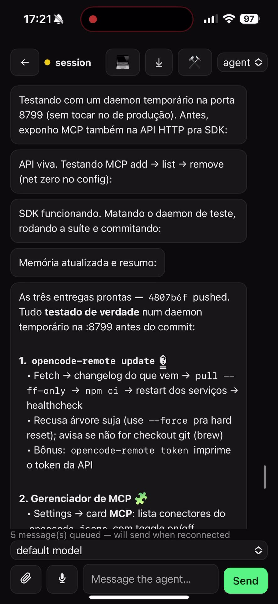

# OpenCode Remote

[🇧🇷 Português](README.pt-BR.md) | 🇬🇧 English

Control the [opencode](https://opencode.ai) agent on your machine from your
phone, from anywhere. **Your machine, your code, your keys** — nothing leaves
your hardware; the relay is a blind pipe that cannot read the traffic.

```
[PWA (phone)] ⇄ [Relay] ⇄ [Daemon] ⇄ [opencode serve]
   passkey+QR      blind       E2E          localhost
```

<p align="center">
  <a href="assets/demo.mp4"></a>
</p>

## Why this exists

Claude Code, Codex and friends run your agent in *their* cloud. OpenCode
Remote runs it on **your** machine — full filesystem, real terminal, your
API keys, any model — and gives you a phone cockpit that is end-to-end
encrypted. The relay never sees plaintext, so even a hosted relay stays
private. That is the product: **local power, remote control, zero trust**.

## What you get

- **Full chat** with streaming, markdown, images and tool-activity history;
  the chat header shows the conversation's title (generic "session" while the
  session has no title yet) and carries quiet ghost action buttons (handoff,
  export, tool activity) matching the composer's icon chrome; a fresh
  conversation shows a welcome empty state
  with quick tips (audio, photo or text). Assistant replies paint straight
  onto the canvas — the bubble is reserved for your own messages. The view
  only auto-follows the
  newest message while you are already at the bottom — scroll up to read and
  a small ↓ pill appears to jump back to the tail; when the connection drops
  a slim banner with the reconnection attempt count replaces the old header dot.
  The model's reasoning streams into a collapsible "Thought for Xs" block —
  expanded while it thinks, collapsed as soon as the answer starts, click to
  re-open; a streaming caret marks the live tail. 
  Code blocks and long lines never clip at the right edge: text and URLs wrap,
  and wide code/diff blocks scroll horizontally inside their own block, so
  nothing ever leaves the viewport (chat, diff modal and artifact pane)
- **AutoMode** — the agent runs hands-free; every auto-approved action is
  audited and pushable. In AutoMode the chat shows no approval cards for
  auto-approved asks — just a passive badge. When the auto-approval itself
  fails (one quick retry, then a final failure), the ask never stalls
  silently: a red note appears above the composer and the ask surfaces as a
  normal actionable card for manual review. Asks that are already answered
  collapse into "resolved" lines, duplicates of the same request render once,
  and tapping a stale card says "Permission already resolved" instead of a
  raw 404
- **Approval preview** — permission cards show the first lines of the
  command/patch being requested (from the permission event payload) before
  you Approve/Deny, so you always know what you're green-lighting
- **Interactive questions** — the model asks, you tap an option from the beach
- **Rewind** — go back to any point of the conversation *and* the code, one tap
- **Context gauge** — when the model's context window is known, the chat
  header shows how full it is for that session (token totals from opencode,
  yellow from 70%, red from 85%), refreshed whenever the agent goes idle
- **Pinned recap** — a one-line strip under the composer shows where the
  conversation left off: the first sentence of the agent's last reply (or the
  session summary when the backend provides one)
- **Voice** — hold to talk, local whisper transcription, no cloud
- **Files** — upload from the phone, preview anything, export a conversation
  as markdown with one tap; every file card has a ⧉ button that copies the
  file's full path (Clipboard API with an execCommand fallback)
- **Handoff** — continue the exact session on your Mac (laptop icon in the
  chat header)
- **Live board** — every session's state at a glance: working, waiting for
  your approval, asked a question, done, errored; cards show relative
  last-activity time (`5m`, `2h`, `3d`); sessions are sorted by most recent
  activity first
- **Session filters** — chips above the search (All / With badge / No badge)
  narrow the board to sessions with or without an unread badge
- **Fast session switching (P1-064)** — opening a conversation fetches only
  the last 50 messages (paged by the daemon with `?limit&before`, sized in
  exact bytes — huge tool outputs are clipped — to stay under the relay's
  frame limit); older history loads on demand via
  "Load older messages" or by scrolling to the top. The last 3 visited
  conversations stay cached in memory, so switching back repaints instantly
  (a background refetch still refreshes the tail), and a timed-out history
  fetch shows an error with a Retry button instead of an eternal skeleton.
  Sessions titled like the autonomous pilot's tasks (`P3-123 …`) collapse
  into a "Pilot sessions" group at the end of the board. The match is by
  task id anywhere in the title (the heuristic cannot tell agent naming
  intent from yours), so one of your own conversations that mentions e.g.
  `P2-049` in its title is grouped as well — rename it to bring it back
- **Per-conversation drafts (P1-088)** — the composer keeps one draft per
  conversation: switch sessions mid-typing and each chat holds its own text;
  sending clears only the conversation you sent from
- **Complete composer (P3-086)** — the chat input is one raised card: a "+"
  button attaches files with an inline preview chip (thumbnail, name, one-tap
  remove), a mic button sits next to it (functional placeholder — disabled,
  with an explanatory tooltip, until the daemon reports transcription
  capability), an inline **agent · model** dropdown replaces the old header
  select and the full-width model list, the textarea auto-grows up to ~6 lines
  and then scrolls internally, Enter sends / Shift+Enter breaks the line
- **Routines** — real cron: daily, specific weekdays, or interval loop
- **Secure by construction** — passkey (WebAuthn) gate, ECDH P-256 + AES-256-GCM,
  replay protection, device allowlist, audit log, biometric unlock
- **BYOM** — opencode supports any provider; pick the model per session
- **API + SDK** — drive sessions from code (`packages/sdk`)
- **Artifacts** — the agent writes documents (html, md, csv, pdf) to
  `~/.opencode-remote/artifacts/<sessionId>/`; the desktop app gains an
  **Artifacts pane** that lists and renders them in-app (sandboxed html,
  markdown/tables, inline PDF) and chat messages that mention an artifact get
  an attached card; on viewports ≥ 900 px wide, clicking the card opens the
  preview in a **side-by-side pane** next to the chat (draggable divider, chat
  stays visible and navigable — Claude/Codex style), while narrower screens
  keep the full-screen overlay; also listed programmatically via `GET /api/artifacts`.
  The global Artifacts list groups by **conversation title** (the daemon resolves
  session ids against the opencode session list; unknown ids fall back to the raw
  id) and, on wide viewports, clicking a list item jumps back to Conversas with
  the preview in the side-by-side pane — no full-screen detour.
  When the agent writes a new artifact the daemon emits a `session.artifact`
  event, and on the turn's next idle the desktop app opens the preview pane
  by itself — never overriding a manual pick, a pane the user closed, or an
  open Browser pane. Previews are capped at **5 MB**: larger artifacts show a
  clear "too large to preview" note instead of stalling the app (the daemon
  answers `413`; the header Save button is hidden because there are no bytes
  to save). The PDF preview runs in a sandboxed iframe (scripts/forms/popups
  blocked). Every session created by the daemon carries the artifacts
  protocol — it is
  injected into the agent's system prompt even in workspaces without an
  `AGENTS.md` (a workspace AGENTS.md that already documents the protocol
  suppresses the injection; sessions created directly in the opencode CLI/TUI
  are not touched). The injected-session registry lives in memory: sessions
  created before a daemon restart are not re-injected after it — only
  sessions created from the fresh daemon are
- **Desktop shell (early)** — Electron app wrapping the same UI, with tray and native menu;
  includes a **Browser pane**: in the desktop shell it renders a real sandboxed Electron
  `<webview>` (scroll, click and edit work like in a browser; `contextIsolation`/`sandbox` on,
  `nodeIntegration` off, popups off), with an editable URL bar, reload and a maximize toggle
  (~80% width). The webview guest always fills the whole pane — including after the maximize
  toggle or a window resize — instead of painting in a top strip (P2-092). The Playwright
  screenshot mode (`/api/browse`) remains the fallback in the PWA
  and the reviewer-driving path (`tools/browse.mjs`)
- **Auto-preview** — when the agent mentions a `http(s)://localhost:<port>` / `127.0.0.1:<port>`
  URL in a reply, the daemon emits a synthetic `ocr.preview` event (deterministic URL parse,
  deduped per session for 10 minutes) and the desktop app opens the Browser pane side-by-side
  with the chat, pointed at that URL, with a back button to the chat. In the PWA the event is
  ignored (the machine's localhost is unreachable from the phone)
- **Mission Control** — navigable post-mortem of the pilot's autonomous runs in the desktop
  app: a card per agent task (goal, progress, effort, ETA) and a forensic timeline parsed
  from the real `pilot.log`/`events.jsonl` (decisions, reviewer verdicts, gate failures with
  output tails, deploys), post-deploy shots, a live dashboard shot and a one-click
  **Take over** (Terminal attached to the agent's opencode session); also served
  programmatically via `GET /api/pilot-forensic`
- **Consistent icon language** — every chrome icon (desktop nav rail, tab bar, chat header,
  artifact cards, status dots) is the same inline-SVG stroke set on top of CSS design tokens;
  every color literal lives in `apps/web/src/tokens.css` (dark + light theme), and
  Settings → Appearance accepts **System/Dark/Light** — System follows the OS
  `prefers-color-scheme` live, with no reload
- **Bilingual UI + keyboard access** — every screen (pairing, chat composer, tool
  activity and diff dialogs) reads from one EN/pt-BR dictionary, dialogs close
  with Esc and trap focus, and the session board is fully reachable by keyboard.
  Connection screens follow one locale end-to-end: daemon-down/reconnecting
  banners, the QR scanner and the desktop home screen resolve their copy from
  the same dictionary as the actions next to them — no pt-BR/English mix on a
  single screen
- **Quiet chrome, one status surface** — the mobile sessions header reads as a
  0.72rem overline (machine name + connection dot) instead of a page title, the
  badge filters fold into a menu attached to the search field (active filter
  marked with a dot on the funnel icon), the desktop empty state ends in a
  composer-styled "New conversation" action, and the daemon status is stated
  once: the shell's reconnecting/down strip replaces — never duplicates — the
  in-chat connection banner

## Quick Start (Mac → iPhone, ~5 min)

```bash
git clone https://github.com/caiovicentino/opencode-remote.git
cd opencode-remote && npm ci
opencode serve --port 4096    # if not already running
node cli.mjs setup --relay=wss://your-host.ts.net:8788
```

The wizard checks node/opencode/whisper/ffmpeg, installs launchd services
with KeepAlive and prints the pairing QR. Point the camera at it from the
PWA and you are in.

The phone's PWA origin is the `com.ocr.pwa` launchd service — it serves the
built `apps/web/dist` statically on `127.0.0.1:5173` (P2-075), never a dev
server. The daemon watches `/healthz` and flags a dead origin on the
dashboard (red chip + `[pwa] origin` event).

## Install as a third party (no tailnet — LAN mode)

The `wss://…ts.net` in the Quick Start is just one way to reach the relay.
Any Mac on the same Wi-Fi can host everything with a locally-trusted
certificate — no tailnet, no public hostname (WebAuthn's passkey gate needs a
secure context, hence the TLS):

```bash
git clone https://github.com/caiovicentino/opencode-remote.git
cd opencode-remote && npm ci
npm run build --workspace @ocr/web
opencode serve --port 4096    # if not already running

# one-time: local CA + certificate for your LAN IP (brew install mkcert)
mkcert -install
LAN_IP=$(ipconfig getifaddr en0)
mkdir -p .certs
mkcert -cert-file .certs/lan.pem -key-file .certs/lan.key "$LAN_IP" localhost 127.0.0.1

# relay + daemon + static PWA origin as launchd services (KeepAlive)
RELAY_URL="wss://$LAN_IP:8788" \
RELAY_TLS_CERT="$PWD/.certs/lan.pem" RELAY_TLS_KEY="$PWD/.certs/lan.key" \
PWA_HOST=0.0.0.0 PWA_TLS_CERT="$PWD/.certs/lan.pem" PWA_TLS_KEY="$PWD/.certs/lan.key" \
NODE_EXTRA_CA_CERTS="$(mkcert -CAROOT)/rootCA.pem" \
  ./deploy/install.sh

RELAY_URL="wss://$LAN_IP:8788" node cli.mjs qr   # pairing QR (embeds the relay URL)
```

Then on the phone (same Wi-Fi): AirDrop `$(mkcert -CAROOT)/rootCA.pem` →
install profile → enable in **Settings → General → About → Certificate Trust
Settings**; open `https://<LAN_IP>:5173` in Safari → **Add to Home Screen** →
scan the QR. Omit the `PWA_*`/`RELAY_TLS_*` overrides to keep the default
tailscale layout — **but note that a fresh clone has no `.certs/`**: without
generated certificates the relay installs plain-ws on 8788, so pair it with
`RELAY_URL="ws://$LAN_IP:8788"` and leave the `PWA_TLS_*`/`NODE_EXTRA_CA_CERTS`
vars out too. `RELAY_TLS_CERT`/`RELAY_TLS_KEY` are a mandatory pair: set both
for direct `wss://` termination or neither — setting only one, leaving a
blank value, or pointing at an unreadable file makes the relay refuse to boot
(exit 1) instead of silently serving plain `ws://`. Every port and cert path is an environment variable
(`RELAY_PORT`, `PWA_PORT`, `PWA_HOST`…). The autonomous pilot service follows
the same rule: `deploy/install-pilot.sh` has no hardcoded hostname — set
`RELAY_URL` in the environment (re-installs without it keep the value already
stored in the plist), plus `NODE_EXTRA_CA_CERTS` when the relay uses a local
CA — recovered from the plist on re-install as well, never silently dropped;
Node never trusts the macOS keychain.

### Desktop app installer (DMG)

Every GitHub release ships a real macOS installer,
`OpenCode Remote-<version>-arm64.dmg` (electron-builder `dmg` target, branded
window). A signing preflight (`apps/desktop/scripts/signing-profile.mjs`) runs
before packaging and picks one of two modes:

- **Developer ID + notarized** — when the runner has a Developer ID
  Application certificate (`CSC_LINK` or `CSC_NAME` secret, with
  `CSC_IDENTITY_AUTO_DISCOVERY` unset or `true`) plus the Apple notarization
  credentials (`APPLE_ID`, `APPLE_APP_SPECIFIC_PASSWORD`,
  `APPLE_TEAM_ID`). The bundle is signed with hardened runtime and the
  `build/entitlements.mac.plist` entitlements, then notarized.
- **Ad-hoc (default)** — without those secrets the DMG ships ad-hoc signed and
  you right-click → **Open** once to pass Gatekeeper. The preflight only turns
  notarization on when the certificate is actually usable: a certificate
  configured while `CSC_IDENTITY_AUTO_DISCOVERY=false` (electron-builder would
  silently ignore it) or notarization credentials without a certificate are
  reported as problems and the build falls back to ad-hoc instead of failing.

Homebrew users get the same code via the `Formula/opencode-remote.rb` formula
(AGPL-3.0-only, checksum pinned automatically by the release pipeline at tag
time).

Since P2-146 the macOS packaging also produces the zip artifact Squirrel.Mac
needs (`<name>-<version>-mac.zip`, additive to the DMG) and the release
workflow publishes `update-mac.json` — a Squirrel.Mac JSON feed built from
`latest-mac.yml` by `apps/desktop/scripts/update-feed.mjs`, with the zip's
release-download URL. **macOS installs update themselves**: the packaged shell
fetches that feed and applies the release in the background (with the consent
dialog below) — but only when the running app is **Developer ID signed**
(P2-136): Squirrel.Mac refuses an update whose code signature does not match
the installed app, so ad-hoc signed builds (the default without signing
secrets) keep the manual flow via the release page.

### Desktop app installer (Windows)

Releases also ship a Windows installer, `OpenCode Remote Setup <version>.exe`
(electron-builder `nsis` target: assisted setup, per-user install, you can
pick the installation directory), alongside the `latest.yml` metadata the
in-app update check falls back to. Until a code-signing certificate is
configured on the release runner (`CSC_LINK` / `CSC_KEY_PASSWORD` secrets),
the installer is **unsigned** and Windows SmartScreen shows "Windows
protected your PC" on first run — click **More info → Run anyway** once; the
same one-time trust dance as the macOS Gatekeeper flow above. With the
signing secrets in place the installer is signed automatically and the
warning goes away.

**Releasing**: a tag `vX.Y.Z` must carry the same version in **both**
`package.json` files (repo root and `apps/desktop`). The release workflow runs
`scripts/release-preflight.ts` as its first step and blocks the release on any
mismatch, and runs `npm run dist:smoke --workspace @ocr/desktop` on the
packaged bundle before uploading the DMG — so bump the two files together with
the tag. PRs that touch the desktop shell, the web UI or `package-lock.json`
additionally run a scoped packaging job (`desktop-package`, mac `dir` target
only, no DMG/signing) smoke-checked with `dist:smoke --no-installer`; the full
signed installers still ship only at tag time.

**What each release must carry** (P2-153): the source tarball
(`opencode-remote-<tag>.tar.gz`) from the `release` job; the macOS side from
`desktop-dmg` — the DMG, the Squirrel.Mac zip (`<name>-<version>-mac.zip`),
`latest-mac.yml` and `update-mac.json`; and the Windows side from
`desktop-win` — the NSIS setup exe and `latest.yml` (the relay image is
published to GHCR and is not a download asset). A final `release-verify` job
lists the published assets with `gh release view --json assets` and runs
`scripts/release-assets.ts` against that list: the release is only considered
complete when that job passes — a missing installer or update feed fails the
workflow (every missing artifact listed at once) instead of surfacing later as
a 404 on the in-app update check.

## Hosted relay (Docker)

Prefer not to host the relay on your own Mac? `deploy/relay/Dockerfile` builds
a small multi-stage image (node 22 slim, tsc-compiled, non-root, `HEALTHCHECK`
on `/healthz`) for any container platform — point your provider's TLS at it,
set `RELAY_URL` on the daemon and re-pair the phone. Release tags build that
image in CI and publish it to GHCR (opt-in: only when the repository variable
`PUBLISH_RELAY_IMAGE` is `true`; without it the tag just proves the image
builds):

```bash
docker pull ghcr.io/caiovicentino/opencode-remote:0.2.0   # pin the version, not latest
```

The image carries no secrets and the relay stays a blind
router: it never sees plaintext or keys. The optional metrics endpoint
(`RELAY_METRICS_PORT`) binds loopback by default; setting
`RELAY_METRICS_BIND` to a network address requires `RELAY_METRICS_TOKEN`
(`Authorization: Bearer <token>`) — the relay refuses to boot an
unauthenticated metrics endpoint exposed to the network. The admission
ceilings (`RELAY_MAX_SOCKETS`, `RELAY_MAX_PER_ROOM`, `RELAY_MAX_FRAME_BYTES`,
defaults 1000 / 10 / 1000000) are env-configurable without recompiling and
validated fail-closed: a non-numeric, zero/negative, per-room-above-sockets
or above-16 MiB frame value makes the relay refuse to boot — reasons logged
once, exit 1, no listener. The same discipline applies to the TLS pair
(`RELAY_TLS_CERT` + `RELAY_TLS_KEY`): a mandatory pair, set both for direct
`wss://` termination or neither to serve plain `ws://` behind a proxy that
terminates TLS — one variable alone, a blank value, or an unreadable file
refuses the boot (reason cites the variable, never the path). On `SIGTERM`
the drain is visible to the load
balancer (P2-145): `/healthz` answers `503` with `ok:false,draining:true`
and WebSocket upgrades are refused while the drain runs, so the balancer
stops routing new peers to the closing instance — the container
`HEALTHCHECK` therefore reports unhealthy during the drain on purpose.
`RELAY_DRAIN_GRACE_MS` (default `0`, max `2000`) delays the socket close
after the 503 so coarse-polling balancers have time to notice. The daemon
validates
`RELAY_URL` at boot and fails closed: only `ws://`/`wss://` URLs dial, and
plain `ws://` at a non-loopback host is refused — an invalid URL disables the
relay connection (reason logged once at boot and surfaced in `/api/health` as
an additive `relay` field) and withholds the pairing QR instead of serving one
the phone can never use; the desktop app's local mode doesn't depend on the
relay and keeps working. Runbook:
[docs/RELAY-HOSTING.md](docs/RELAY-HOSTING.md).

**Close-code-aware relay retries (P2-156)**: when the relay socket closes, the
daemon classifies the close code instead of treating every drop as a network
outage. `1013` (server busy / too many connections / room full) means the
relay is at capacity and floors the reconnect wait at 30s; `4029` (rate
limited) floors it at 60s; `1001` (draining) and `1000` reconnect on the
regular schedule; anything else (including an abrupt 1006-style drop) keeps
the P2-129 jittered backoff unchanged. The verdict shows up as additive
`closeCode`/`closeKind` fields on the `relay connection lost` log line and as
`lastClose: { code, kind }` inside `/api/health`'s `relayRetry` object — the
raw close reason is never exposed.

## CLI

```bash
node cli.mjs doctor    # full diagnostics: binaries, health, services, devices
node cli.mjs qr        # re-print the pairing QR
node cli.mjs status    # launchd services state + paired devices
node cli.mjs start     # restart services (relay + daemon + pwa)
node cli.mjs update    # pull, reinstall deps, restart — one-command upgrades
node cli.mjs token     # print the local HTTP API token
```

## HTTP API & SDK

Scripts and integrations can drive the agent on the same machine:

```js
import { createClient } from "@ocr/sdk";

const ocr = createClient({ token: process.env.OCR_TOKEN });
const { id } = await ocr.createSession();
const reply = await ocr.sendAndWait(id, "explain the auth module");
```

See [docs/api.md](docs/api.md).

## Architecture & security

- [docs/architecture.md](docs/architecture.md) — tunnel, chunking, services
- [docs/security.md](docs/security.md) — crypto, pairing, threat model
- [docs/troubleshooting.md](docs/troubleshooting.md)
- [docs/capacitor.md](docs/capacitor.md) — native iOS shell recipe

## Pilot — autonomous development (24/7)

This repo evolves itself: the Pilot service ([docs/PILOT.md](docs/PILOT.md)) picks tasks from
[BACKLOG.md](BACKLOG.md), implements them with agents, has them reviewed by two independent
adversarial reviewer agents, and only merges when the deterministic gatekeeper (eval battery +
[executable constitution](docs/CONSTITUTION.md)) is fully green. Deploys are staged with health
watch and automatic rollback. Freezing: `touch ~/.opencode-remote/pilot.lock`.

## Desktop app (early)

The first stage of the [desktop vision](docs/VISION.md): an Electron shell
([`apps/desktop`](apps/desktop)) that opens the cockpit in a native window,
with a tray icon, native menus and a sandboxed renderer — no terminal, no
Tailscale. It loads the same `@ocr/web` build as the phone.

The shell runs on **Electron 44** (Chromium 152, V8 15.2, Node 24.18.1),
which requires **macOS 13 (Ventura) or later**.

Since P1-046 the window is a real two-column cockpit: the conversation stays
open in the left column while Artifacts, Browser, Files or Settings open in a
contextual pane on the right (switching panes never destroys the chat), and
the whole navigation lives behind a single view stack. Keyboard shortcuts
(also in the **Go** menu): `Cmd+T` new conversation, `Cmd+K` command palette
(search conversations and actions), `Cmd+1..6` switch to chat / Artifacts /
Browser / Files / Settings / Mission Control.

**Living home (P2-123)**: with no conversation selected the cockpit shows a
real home instead of a dead end — a serif greeting ("Back in action, &lt;machine&gt;",
from the same EN/pt-BR dictionary), a central composer with placeholder, a
Chat/Cowork mode toggle (Cowork pre-selects the `build` agent for the next
session), the model selector and a working press-and-hold mic (dictates into
the composer via the same transcription flow as the chat mic) on the bottom
row, and three clickable "Ideas for you" that open a new session with the
prompt pre-filled (failure surfaces an inline error, never a frozen screen).

**Design tokens & reading typography (P3-083)**: the conversation column is
capped at ~46rem and centered like the Claude Desktop benchmark, with a
purposeful type scale (15–16px body, 1.65 line-height), motion standardized
on 150/300ms ease-out tokens (fully disabled under `prefers-reduced-motion`,
including programmatic scrolls) and a six-step dark-gray ladder where every
step has one role — canvas, chrome, raised surface, hover, resting and active
borders. All color/type/spacing/motion literals live in `apps/web/src/tokens.css`.

**Benchmark conversation list & ⌘K (P3-084)**: the sidebar groups conversations
into **Today / Yesterday / Earlier** (bounded by local calendar midnights, so
DST-change days group correctly), the open conversation gets a sharp active
state (tinted row + accent bar), truncated titles ellipsize with a full-name
tooltip, and hovering a row reveals **rename** and **archive** actions in the
timestamp's slot. Archiving is per-device (localStorage) and reversible —
archived conversations move to a collapsible "Archived" group at the end of
the list (hidden on the phone board too, with a restore action in the group).
The `Cmd+K` switcher now shows the **last known message line** under each
conversation in the search results.

**Claude-level sidebar shell (P2-124)**: the desktop sidebar is a 280px
navigation shell — a full-width **"+ New"** primary button and the section nav
(Conversations, Artifacts, Browser, Files, Mission Control, Settings —
consistent SVG icons, zero emoji) pinned to the top, the grouped conversation
list (search + badge filters + Today/Yesterday/Earlier) in the middle, and a
fixed **account footer** at the bottom showing the machine avatar/initial,
name and connection mode ("Local · this machine" / "Remote · paired"). The
footer opens the machine picker, the same overlay as the mobile header.

**Degraded first boot (P2-112)**: when the local daemon is unreachable on
first launch, the app no longer dead-ends on the pairing screen. A calm status
card — "Connecting for the first time…" for a daemon this machine has never
met, never a red "daemon fell" alert — explains that conversations, files and
artifacts sync as soon as the daemon answers, shows the automatic retry, and
keeps the purely-local data (language, theme) working. "Reconnect now" gives
real feedback (spinner + trying state + result toast), and manual pairing
stays one click away.

**First-run welcome (P2-148)**: the very first desktop launch walks through
three steps — what the app is (one sentence), the local agent's live state
(reusing the calm degraded-journey copy and the P2-138 upstream notice), and
the phone-pairing invitation with an explicit "do this later". It is skippable
at any moment; finishing or skipping stamps a flag in the renderer's
localStorage (no IPC, no main-process change), so existing users — including
everyone upgrading with a stored pairing — never see it. It renders as a
single full-screen surface: no banners, no pairing overlay (P2-108 rule).

**Upstream notice (P2-138)**: the daemon can be healthy while the agent server
it proxies is not (`opencode serve` not installed, wrong port, changed
password). `/api/health` carries the classified verdict (`opencode.state`:
unauthorized / unreachable / timeout / unhealthy) and the desktop shell
forwards it to the renderer over the same channel as the version fields. The
calm first-boot card and the new **Agent server help** section at the top of
Settings then say exactly what happened and what to do — as one block inside
an existing surface, never a second banner — with a secondary button that
opens that help section straight from the first-boot card. The daemon's own
reason/hint strings render as secondary text only; no tokens or secrets are
ever part of the displayed copy.

**Benchmark pairing journey (P2-106)**: the manual pairing screen is a narrow
(~420px), vertically centered column with a one-sentence intro and two titled
sections — **Connect to another machine** (scan/paste, this device as client)
and **Pair a phone with this machine** (host entry). An invalid pairing code
renders a styled error block with an inline helper showing the expected
`opencode-remote://pair?…` format (announced to screen readers), and on the
first-run QR splash "Pair later" is now a quiet text link — the QR is the only
primary element on that screen.

**Auto-preview (P1-072)**: when the agent brings up a local site (http.server,
vite, a dev server…) and mentions `http://localhost:<port>` in its reply, the
Browser pane opens by itself next to the chat, pointed at that URL, rendered
as a real sandboxed webview — scroll, click and form edits are live. The URL
bar is editable, `↻` reloads, `⤢` toggles the pane to ~80% width and back, and
`←` returns to the chat. A load failure shows an error and the reload button
instead of a blank pane.

**Mission Control** (Cmd+6) is a navigable post-mortem of the pilot's
autonomous runs: one card per agent task (goal, progress, wall-clock effort,
ETA while running) parsed from the real `pilot.log`/`events.jsonl`, plus a
forensic timeline per task — every builder decision, reviewer verdict, gate
failure (with output tail) and deploy navigable, the post-deploy screenshots,
a live dashboard shot via the browse surface, and a **Take over** button that
attaches Terminal to the agent's own opencode session for human handoff.

**Unread badge (P3-053/P2-150)**: when a message lands in the open conversation
while the window is in the background — or while you are scrolled away from
the tail — the app icon shows the indicator: a count on the macOS dock / Linux
and a green overlay disk on the Windows taskbar icon. Focusing the window or
jumping back to the tail clears it.

```bash
npm run build --workspace @ocr/web       # build the UI once
npm run build --workspace @ocr/desktop   # compile the shell (TypeScript main process)
npm start  --workspace @ocr/desktop      # open the window
npm run dist --workspace @ocr/desktop -- --dir  # package web UI + daemon sidecar
```

During web development, point the shell at the Vite dev server:
`OCR_WEB_URL=http://localhost:5173 npm start --workspace @ocr/desktop`.
`npm run dist` is self-sufficient: it builds the web UI and the shell
(TypeScript + daemon bundle) before packaging, so the command also works on a
clean checkout.

**Packaging (P1-050)**: `npm run dist --workspace @ocr/desktop` now also
produces a distributable **`OpenCode Remote-<version>-arm64.dmg`** (branded
installer window, semantic version in the About panel and in the DMG file
name) — and `npm run dist:smoke --workspace @ocr/desktop` verifies the
bundle **and** the DMG artifact. Local builds are ad-hoc signed with hardened
runtime and the shared entitlements (`build/entitlements.mac.plist`) — on
first launch, right-click → **Open** once to pass Gatekeeper; afterwards the
app behaves like any installed app. Tag releases ship that DMG +
`latest-mac.yml` on GitHub (`.github/workflows/release.yml`); the release's
signing preflight notarizes only when a Developer ID certificate and the
Apple credentials are actually configured (see *Desktop app installer*). The
same release pipeline ships the **Windows NSIS installer**
(`OpenCode Remote Setup <version>.exe` + `latest.yml`) from a `windows-latest`
runner — unsigned (SmartScreen, see the Windows section above) until the CSC
signing secrets are configured; the smoke check validates the setup exe and
the metadata on any OS, no Windows required.

**Auto-updates with consent (P1-050)**: the packaged shell checks the daemon's
loopback updates folder (`http://127.0.0.1:8792/__ocr/updates/` — a versioned
folder served by the same local daemon, no new network surface) at boot and on
demand from the tray (**Check for updates**). P2-098: when that staged feed is
absent — the normal case on a plain DMG install — the shell falls back to the
public yml feed attached to the latest GitHub release, so the tray still
reports "update available" on third-party machines. P2-131: that fallback is
platform-aware — `update-mac.json` on macOS, `latest.yml` on Windows, and no
feed at all on other platforms (the whole check stays `disabled` with zero
network requests there) — and `OCR_PUBLIC_UPDATE_FEED` remains an absolute
override that ignores the platform. The two platforms update differently: on
**macOS** the public fallback is a real Squirrel.Mac JSON feed (P2-146), so
the release downloads in the background and the consent dialog applies it —
the download only completes on a Developer ID signed build (P2-136), while
ad-hoc signed installs stay manual; on **Windows** there is no
download engine yet (Squirrel.Windows support pending), so a yml feed resolves
to `update-available-manual` and an explicit **Check for updates** click opens
the release page — at most once per version per session, and never
automatically at boot (the boot decision is log/tray only, P2-131) — nothing is
downloaded or installed behind your back. The fallback triggers for
the packaged default only — a feed pointed at explicitly via `OCR_UPDATE_FEED`
never produces an outbound request behind your back. When a newer `feed.json`
is found on macOS, the release downloads in the background and a consent dialog
offers **Restart now / Later** — nothing installs without an explicit click, a
deferred version is not re-offered during the session, and repeated checks
never stack stale offers. Staging a release is a plain copy:
drop `<version>/` with the artifact under `~/.opencode-remote/updates/` and
rewrite `feed.json` (see `docs/troubleshooting.md`). Dev runs stay opt-in via
`OCR_UPDATE_FEED`.

**Crash reports & diagnostics (P1-050)**: fatal main-process errors and
renderer crashes land as timestamped files under
`~/.opencode-remote/pilot/client-logs/` (newest 20 kept). Settings gains a
**Diagnostics → Copy diagnostic** card that puts a support bundle on the
clipboard — app/electron versions, platform, daemon state, the last desktop.log
lines and the crash-file names. No secrets: the apiToken, allowlist and
pairing URI are never included.

**One shell per userData (P2-069)**: launching the app while an instance is
already running simply focuses the existing window — a second copy never
paints its own (possibly white) window. Every boot writes an instance record
into its `userData`; if an older instance of the *same* userData is still
alive with an earlier start, the new boot logs a `possible zombie instance`
warning to `desktop.log` so a leaked shell (e.g. one whose keeper/parent died)
is diagnosable from the **Open logs folder** item. Hermetic harness launches
(`tools/desktop.mjs`) additionally watch the keeper's pid and quit by
themselves when it disappears, so killed test runs can no longer leak
Electron instances.

The desktop shell boots the daemon as a **sidecar**: on launch it spawns the
daemon — in packaged apps a single-file CJS bundle shipped at
`resources/daemon/index.js` (built with esbuild during `npm run build`; the
`/dashboard` route is served from a `dashboard.html` shipped next to it, since
the CJS bundle has no `import.meta`; dev checkouts run the TypeScript source
via the workspace `tsx` install, and `OCR_DAEMON_ENTRY` overrides both) — waits
for `GET 127.0.0.1:8792/api/health`
to answer **with an authenticated 200** before showing the UI, and terminates
the child on quit. The health probe challenges the responder unauthenticated first and only
sends the bearer token to something reproducing the daemon's 401 signature, so a
generic 200-anywhere process squatting on the port is never trusted nor fed the
token. A daemon already on the port (launchd/CLI install) is reused only when
the 0600 state file yields the token that proves its identity — otherwise the
shell spawns its own. Override the port with `OCR_DAEMON_METRICS_PORT` (falls
back to `OCR_METRICS_PORT`); the spawned child binds exactly the port the shell
polls. The dashboard HTML never carries the apiToken: authenticate with the
token box (or `?token=`, stored in localStorage) or exchange the Bearer token
once via `POST /api/session` for a 12-hour HttpOnly `ocr_session` cookie that
authorizes `/api/*` until the daemon restarts.

**Honest agent-server health (P2-135)**: `/api/health` keeps the legacy
`opencodeHealthy` boolean and now also exposes an additive `opencode` object —
`state` (`unknown` until the first probe, then `ok`, `unauthorized`,
`unreachable`, `timeout` or `unhealthy`), a short `reason`, an actionable
pt-BR `hint` and the `checkedAt` timestamp of the last probe. The classifier
distinguishes what used to collapse into one generic failure: server not
installed, wrong port, refused token (401) and a slow/hung server now each
carry a specific reason. Since P2-149 the `opencode` object also carries
`binaryFound` and `binarySource`: `binaryFound` is true when an executable
`opencode` binary exists on this machine (resolved from `PATH` plus known
install locations once at boot, refreshed at most once a minute while the
upstream is unreachable), and `binarySource` is `"path"`, `"known"` or `null`
depending on where it was found — so a refused connection reads as "start the
server" when a binary exists and as "install opencode first" when it does not.
No absolute path, token or password ever appears in `reason`, `hint` or the
payload — only the boolean and the origin. The "opencode is DOWN" push uses the
classifier's hint as its body (prefixed with the machine name), so the phone
tells you what to do instead of repeating a fixed phrase. The full contract
lives in `docs/api.md`.

**Zero pairing on the host machine**: the desktop shell treats the daemon on
the same machine as one trust domain (loopback, same user, 0600
`daemon.json`). If that daemon proves healthy at boot — the shell's
anti-squatter 401 challenge followed by an authenticated 200 — the app opens
straight into the chat: no pairing screen, no QR, nothing to scan (P1-070).
The QR ceremony only exists for remote clients: it appears when no local
daemon is reachable, or on demand via **Settings → Pair a phone (remote
device)** or an `opencode-remote://` deep link. When a phone still needs to
pair on first run, the QR opens with a proper **welcome splash** (pt/en): the
product value up front and a three-step onboarding promising the first real
value in under a minute. The manual QR/paste screen remains as a fallback
(machines switcher → add machine). On the desktop, **paste/deep-link is the
primary path** — pointing a camera at another screen is a circular flow — and
the in-app scanner is a visible state machine (looking → live preview →
unavailable) that always offers the paste fallback; an empty camera feed
(capture device with no signal) resolves to the unavailable state instead of
rendering the device's own OSD placeholder.

**Direct local connection (P1-061)**: on the host machine the desktop app
skips the relay entirely — it dials the daemon's loopback WebSocket
(`ws://127.0.0.1:8792/ws`, authenticated with the local token from the 0600
state file). Deploy kickstarts of the relay no longer interrupt a running
session, and after any reconnect the open conversation is refetched so
messages produced during the gap show up without a resend. Remote access
(phone, away from home) keeps using the relay as before; the current wire is
shown in Settings → About ("Connection: direct (local) / via relay").

**Pairing deep links**: the packaged desktop app registers the
`opencode-remote://` protocol with the OS (macOS/Windows). An install or
invite page can open the app with an `opencode-remote://pair?v=2&…` link and
it pairs itself through the same path as pasting a code — no QR scan. Links
are validated in the shell (pair action, protocol version 2, query capped at
4 KB, safe character set) and everything else is ignored. The registration
only happens in the packaged app; a dev run never claims the OS handler.

**Self-healing sidecar**: if the spawned daemon dies at runtime (crash, OOM,
stray kill), the shell respawns it automatically with a growing backoff —
5s, then 15s, then 45s. The failure counter resets as soon as `/api/health`
answers 200 again, so an isolated crash never escalates. After 3 consecutive
failed attempts the shell gives up (logging
`[desktop] daemon sidecar gave up after 3 attempts`), shows a persistent
"local daemon is down" warning in the UI through the pairing-state channel,
and an authenticated daemon that appears on the port (e.g. a launchd install)
is adopted instead of spawned on top of. Restarting the app always resets the
cycle — and the tray's **Restart daemon** action (below) does the same without
relaunching.

**Honest degradation when an adopted daemon vanishes**: when the shell reuses
an external daemon (a launchd/CLI install already answering on the metrics
port) there is no child to respawn and no budget to exhaust — losing it is
never terminal. The shell probes the daemon with an infinite backoff
(5s → 15s → capped at 30s) and the UI shows a yellow
"Reconnecting to daemon… (n)" banner (`role="status"`) with the attempt
counter; no QR overlay can open from this state and no child is ever spawned
against the external supervisor. When the daemon answers again, the banner
disappears and the previous session is picked up with **no re-pairing** — the
desktop never rewrites the 0600 state file and never adds allowlist entries.
The red "daemon is down" banner is now only for the hosted sidecar give-up
case and carries a **Reconnect now** button wired to the same restart as the
tray action — so a daemon `kickstart`d by a deploy no longer leaves the app
stuck on the pairing screen.

**Daemon/app version mismatch banner**: because the shell adopts an external
daemon (launchd/CLI install), it can end up talking to a daemon older than the
app itself — the symptom for a lay user is random breakage, not a clear
message. The shell now reads the daemon's version from the same authenticated
`/api/health` probe it already uses and, when the daemon's major differs from
the app's or the daemon is simply older (a `-dev` suffix is tolerated, a daemon
minor ahead is fine), shows a non-blocking yellow strip: "Daemon vX · app vY —
reinicie o daemon" ("restart the daemon"), with the same **Reconnect now**
one-click recovery button. Compatible versions render nothing, and a browser
without the desktop bridge is never affected.

**Crash-proof shell**: a renderer crash no longer leaves a dead white window —
the shell logs the crash reason and reloads the UI automatically (bounded to
3 reloads per minute so a page that crashes on boot cannot become a reload
loop). And if the main process itself hits an unexpected exception, the app
now quits gracefully: the error is logged with its stack and the exit runs the
normal quit path, which stops the daemon sidecar cleanly instead of orphaning
it.

**Tray: daemon health + start at login**: the tray tooltip doubles as a
sidecar health indicator — it reads `OpenCode Remote — daemon ok` /
`OpenCode Remote — daemon down`, refreshed by the same 3s poll that feeds the
pairing overlay. The context menu also has a **Start at login** checkbox
(macOS/Windows) backed by `app.setLoginItemSettings`, so the toggle persists
across app restarts and OS reboots. Right below **Open OpenCode Remote** sits
an always-present **Restart daemon** action: it cancels any pending respawn,
resets the crash budget, stops the daemon the shell spawned and starts it
again — the one-click recovery when the sidecar gave up ("daemon down") or an
adopted daemon turned unstable, no quit-and-relaunch needed. The action is
best-effort: it is a no-op with a clear log line when no daemon was ever
started, and any failure is logged without taking the shell down. An
**Open logs folder** item (just above **Quit**) creates the logs folder if
needed and reveals it in the OS file manager — the lay-user entry point into
the persistent shell log described below. The
menu-bar glyph is a monochrome
template image (`apps/desktop/build/trayTemplate.png`, generated by
`make-icon.mjs` alongside the app icon) that macOS recolors to match the
light/dark menu bar, degrading to an embedded 16px glyph when the asset is
unavailable.

**Native notification when the daemon stops**: if the sidecar's respawn budget
is exhausted, the shell fires a one-time native notification —
`daemon parou — use "Reconectar agora" no OpenCode Remote` — and
`daemon de volta` when a
healthy daemon answers again. Each transition notifies exactly once (deduped
by the same 3s poll that feeds the tray tooltip) and the feature is
best-effort: on platforms without notification support the shell keeps
running silently, and with the window closed to the tray this is how a
non-technical user finds out control was lost. On Windows the shell also
registers its AppUserModelID at boot (`com.culturabuilder.opencode-remote`,
matching the packaged appId) — without it win32 toasts are silently dropped
by the OS, so this is what makes notifications functional there.

**Close-to-tray keeps the daemon alive**: closing the window (red button,
`Alt+F4`) no longer quits the app — on every platform the window hides and the
daemon sidecar keeps running, so the phone never loses its connection just
because the window went away. Reopen the window from the tray
(**Open OpenCode Remote**) or by launching the app again; **Quit** in the tray
menu (or `Cmd+Q` on macOS) performs a real quit with full daemon cleanup. The
first time the window is closed, a one-time native notification says the app
keeps running — in the menu bar on macOS, in the system tray on Windows/Linux
— and how to reopen it; it is shown once and never again.

**Real app icon + About panel**: the shell ships a real 512×512 icon
(`apps/desktop/build/icon.png`, generated by the zero-dependency script
`apps/desktop/scripts/make-icon.mjs`) — used by `electron-builder` for the
packaged app on macOS/Windows/Linux, as the window icon (Windows/Linux), the
macOS dock icon, and the About panel shows the app name plus the actual
version (`About OpenCode Remote`). Regenerate the icon after tweaks with
`node apps/desktop/scripts/make-icon.mjs`.

**The window remembers its size and position**: move/resize the window, quit
and reopen — the bounds are restored. They live in
`userData/window-state.json`, written on close, and are validated against the
displays currently attached at boot: a window left on a since-disconnected
screen (or a corrupted state file) falls back to the 1280×820 default instead
of opening off-screen or crashing.

**Persistent shell log**: the desktop app appends everything the main process
logs (`[desktop] …` lines: daemon sidecar lifecycle, pairing polls, renderer
crashes, fatal errors) to `userData/logs/desktop.log` — so a packaged app used
by someone without a terminal still has a diagnosable trail. The file is
capped at ~1MB and rotates to `desktop.log.1` (only 2 files kept); if the disk
is full the app keeps running and simply stops writing log lines. To find the
folder, use the tray's **Open logs folder** item (it creates and reveals the
folder even if it was deleted); on macOS it is
`~/Library/Application Support/OpenCode Remote/logs/`.

**Daemon sidecar log**: the daemon the desktop app spawns writes its JSONL
output to the same `userData/logs/daemon-sidecar.log` (rotating to
`daemon-sidecar.log.1`, ~1MB cap, 2 files kept — write failures are silently
ignored). In the packaged app the daemon's stdout/stderr used to be forwarded
to a console that does not exist; the tray's **Open logs folder** item now
logs which file holds what.

**First-run QR for your phone**: the first-run overlay with a scannable pairing
QR (rendered by the main process from the daemon's `GET /__ocr/pairing-uri`, a
read-only loopback route gated by the same bearer token) is reserved for remote
clients — it appears when no local daemon is reachable, or on explicit request
from **Settings → Pair a phone (remote device)** (P1-070). The shell polls the
allowlist every 3s — once a phone pairs the overlay leaves and the chat
appears. "Pair later" dismisses it for the session.

**Staged update feed (spike P2-012, real flow since P1-050)**: the shell checks
for updates against a static feed you host — a loopback URL is enough. The
check runs at boot and on demand from the tray, and only acts when a feed is
configured: an explicit `OCR_UPDATE_FEED` (dev/staging) or, in packaged builds,
the daemon's loopback updates folder by default:

```bash
OCR_UPDATE_FEED=http://127.0.0.1:9310/feed.json npm start --workspace @ocr/desktop
```

The feed directory can contain an electron-builder-style `latest-mac.yml`
(`version: 0.2.1` + fake release notes) or a Squirrel.Mac JSON feed (`feed.json`
with `url`/`name`/`notes`) — both are parsed and a newer release is logged as
`update-available`. For JSON feeds the release is also handed to Electron's
built-in `autoUpdater` (`setFeedURL` + `checkForUpdates`, `serverType: "json"`),
which downloads it in the background. yml feeds have no download engine (the
built-in updater cannot read `latest-mac.yml` — spike finding): since P2-131
they resolve to the dedicated `update-available-manual` status, and the release
page opens via `shell.openExternal` only when the user explicitly clicks
**Check for updates** — never automatically at boot, and at most once per
version per session. GitHub-hosted feeds point at the repo's releases page;
self-hosted `OCR_PUBLIC_UPDATE_FEED` overrides point at the feed's own
directory (where the artifacts live). `setFeedURL` is only ever called on the
JSON feed path. Feed or network
failures are strictly log-only and never block or crash the window.

Whenever a feed is configured, the tray menu also gains two items (P3-019): a
disabled status line reflecting the latest check ("Update available — check for
updates", "Update available — open release page", "Update ready — restart to
install", "Up to date", or the failure reason) and a clickable "Check for
updates" item that re-runs the check and refreshes the menu in place. Applying
a release always goes through the consent dialog (P1-050): the updater asks
"Restart now / Later" once the download finishes — a deferred version is not
re-offered in the same session. On macOS the packaged shell updates itself
this way, and the same Squirrel JSON feed is published on every GitHub release
(`update-mac.json`, built by `apps/desktop/scripts/update-feed.mjs` from the
packaged `latest-mac.yml` + mac zip — P2-146) so third-party installs
auto-update too, but only when the app is Developer ID signed (P2-136):
Squirrel.Mac rejects an update whose signature does not match the installed
app, so ad-hoc builds keep the manual release page. On Windows (no
Squirrel.Windows integration yet) the shell opens the release page instead of
downloading anything (P2-131).

## Roadmap

Next up: onboarding wizard, skills sharing, native iOS push.

## License

Open core, chosen so the community gets the client and the business gets the
service:

| Part | License | Why |
|---|---|---|
| `apps/relay` (the hosted side) | **AGPL-3.0-only** | anyone hosting it for others must ship their source — no parasitic SaaS |
| `apps/daemon`, `apps/web`, `cli.mjs`, `tools/` | **AGPL-3.0-only** | the product stays open and self-hostable, forever |
| `packages/sdk`, `packages/protocol` | **MIT** | build integrations and products on top, no strings |

Your own deployments, forks and internal use are unrestricted either way —
AGPL only bites if you offer the software as a network service to third
parties and withhold the source.

---

🇧🇷 Este projeto também fala português: [README.pt-BR.md](README.pt-BR.md)
